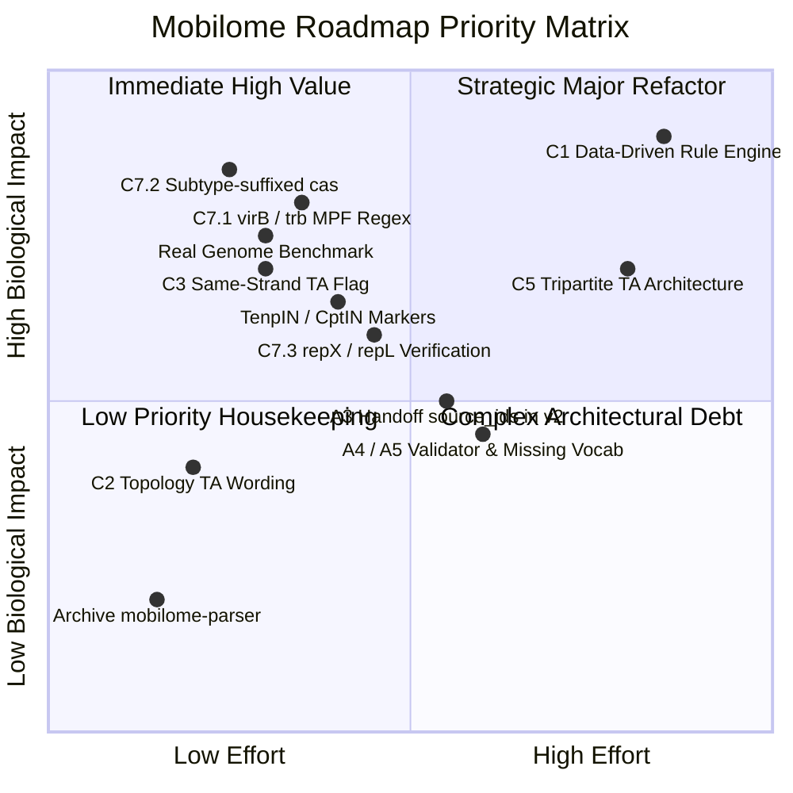

# Mobilome Subsystem: Deferred Items & Architectural Review

**Document Version:** 1.1.0  
**Date:** 2026-09-06  
**Status:** Strategic Architecture, Schema, and Scientific Expansion Roadmap  
**Scope:** Synthesis of all deferred items, scientific inquiries, and v2 candidate designs across `mobilome-parser-integration-plan.md`, patches `0.1`-`0.3`, and `gbparse-patch-0.6.5-mobilome.md`.

---

## 1. Schema & Architectural Findings (v2 Candidates)

### Finding A3: External Handoff Architecture & Schema Home
* **Question from Maintainer:** *Do I need to run external tools (MOB-suite, PlasmidFinder, AMRFinderPlus, VFDB, PHASTER, geNomad, ISEScan, MobileElementFinder) and serve their outputs to draft handoffs?*
* **Architectural Reality:** **No.** `gbparse` intentionally does not invoke external CLI binaries or remote web APIs. The core design principle of `gbparse` is single-pass, fail-closed, deterministically reproducible flatfile parsing and evidence retention.
* **What "Handoffs" Actually Are:**
  In `report.schema.json` (`gbparse.mobilome.v1`), the `handoffs` section serves as machine-readable boundary documentation. When `gbparse` detects product text matching AMR (e.g. `"beta-lactamase"`), it retains it *only* as an annotation candidate and outputs an explicit handoff block:
  ```json
  {
    "handoff_id": "amr_annotation",
    "tool": "AMRFinderPlus",
    "purpose": "Structured antimicrobial-resistance annotation",
    "status": "not_run",
    "reason": "Generic product text is retained only as an annotation candidate.",
    "required_input": ["protein or nucleotide sequence"],
    "required_provenance_fields": ["tool_version", "database_version", "organism_option", "method", "thresholds"],
    "limitations": ["A tool annotation is not a phenotype measurement."]
  }
  ```
* **The Defect / Limitation:** In Schema v1, handoff objects lack a `source_ids` array. Unlike hits and hypotheses, which cite specific literature keys in `provenance.yaml`, handoffs cannot carry citations directly in the JSON without triggering schema validation errors.
* **v2 Resolution:** Add an optional `source_ids: list[str]` field to the handoff definition in `report.schema.json` v2 so handoffs can directly anchor their primary tools (e.g., `feldgarden-2021-amrfinderplus`, `camargo-2024-genomad`).

---

### Finding A4: Generic Validator Whitelist in `database.py`
* **Question from Maintainer:** *What is the "generic validator's allowed retained-evidence set"??*
* **Context & Implementation:**
  In `inference.yaml`, when aggregate rules are disabled in v1 (such as `phage_module_bearing_plasmid_candidate` and `pxo_like_annotation_pattern_candidate`), they specify `evidence_retained_as` to declare which underlying evidence categories are still collected.
  * For Phage: `evidence_retained_as: [phage_integration, phage_lysis, phage_packaging, phage_regulation, phage_replication, phage_structure]`. All of these strings correspond to valid **Facet IDs** defined in `markers.yaml`.
  * For pXO: `evidence_retained_as: [pxo_numbered_product_annotation]`. Here, `pxo_numbered_product_annotation` is **not** a Facet ID--it is a **Marker ID** (its facet is `pxo_numbered_product`).
* **The Code Artifact in `database.py` (line 691):**
  ```python
  unknown = sorted(
      set(retained) - facet_ids - {"pxo_numbered_product_annotation"}
  )
  if unknown:
      raise MobilomeDatabaseError(
          f"Disabled aggregate rule {rule_id} has unknown retained evidence: {', '.join(unknown)}"
      )
  ```
  Because the validator was built assuming all retained evidence tokens are Facet IDs, `pxo_numbered_product_annotation` caused a validation failure unless manually whitelisted in Python code.
* **v2 Resolution:** Replace the hardcoded string subtraction with a declared YAML token schema or allow `retained_evidence` to resolve against `facet_ids | marker_ids`.

---

### Finding A5: Mixed Vocabularies in `missing_components`
* **Question from Maintainer:** *What is a Facet ID vs a Component ID? Is it a cluster completeness thing?*
* **Core Conceptual Model:**
  1. **Marker (`markers.yaml`):** The atomic detection pattern (e.g., regex pattern `(?i)^cas9$` matching field `gene`).
  2. **Facet (`markers.yaml`):** The biological concept grouping one or more markers (e.g. `mobility_relaxase`, `mobility_t4cp`, `mobility_mpf`, `replication_origin`, `replication_initiation`, `ta_toxin`, `ta_antitoxin`).
  3. **Component (`inference.yaml`):** An aggregation rule over facets. For example:
     ```yaml
     components:
       helper_machinery:
         all_of_facets:
           - mobility_t4cp
           - mobility_mpf
       replication_candidate:
         any_of_facets:
           - replication_origin
           - replication_initiation
     ```
  4. **Rule (`inference.yaml`):** An inference policy requiring one or more components (or markers).
* **The Discrepancy:**
  When a multi-component mobility rule fails (e.g. conjugation machinery missing MPF), the emitted `missing_components` array contains the **Facet ID**: `["mobility_mpf"]`.
  However, when the replication path fails (`_infer_component_rule` in `inference.py`), it falls back to:
  ```python
  missing=missing or ("replication_candidate",)
  ```
  Here, `"replication_candidate"` is a **Component ID**, not a Facet ID!
* **v2 Resolution:** Standardize `missing_components` to emit strictly Component IDs (with a nested `missing_facets` field) or uniformly emit Facet IDs across all rules.

---

### Spatial Limitations Home & Record-Level Caveats
* **Question from Maintainer:** *What are spatial limitations, and why do they need their own home?*
* **Context:**
  Compound locations (e.g. `join(100..200, 300..400)`) are **fully supported** in `gbparse` and parsed into ordered `LocationSegment` intervals where `intervening_gap_bp` calculates the minimal pairwise distance across segments.
  Spatial distance calculation is skipped **only** when a feature has **absent or invalid segments** (`location=None` or empty `segments=()`).
* **Current v1 Workaround:**
  In Schema v1, the only per-record limitations array exists on the replicon inventory classification object: `RepliconInventory.classification.limitations`.
  Consequently, warnings like `"type_iii_toxin_antitoxin_pair_candidate: at least one same-record toxin/antitoxin candidate is unlocatable; spatial pairing was skipped"` get bundled into the classification limitations alongside `"Source plasmid declaration missing"`.
* **v2 Resolution:** Add a top-level field `RepliconInventory.spatial_limitations: list[str]` to decouple replicon classification caveats from locus spatial-pairing caveats.

---

### Catalog ID Hygiene (Facet vs Marker Shadowing)
* **Context:**
  In `markers.yaml`, markers `crispr_array` and `crispr_cas` belong to facets named `crispr_array` and `crispr_cas`.
  Shadowing the facet name with the marker name makes it easy for rule authors to confuse whether an inference requirement references a specific marker or an entire facet category.
* **v2 Resolution:** Prefix or namespace marker IDs (e.g. `marker:crispr_repeat_array` vs `facet:crispr_array`).

---

## 2. Inference Logic & Rule Engine Deferreds

### Finding C1: Co-Configured Rule Engine (Hardcoded Dispatch)
* **Question from Maintainer:** *What does a fully data-driven engine look like?*
* **Current Code Bottleneck (`inference.py`):**
  Currently, `infer_replicon_hypotheses` does not execute rules dynamically from `inference.yaml`. Instead, it contains:
  ```python
  for rule_id in (
      "replication_annotation_candidate",
      "mobilizable_core_annotation_candidate",
      "helper_machinery_annotation_candidate",
  ):
      hypothesis = _infer_component_rule(replicon, local_hits, database, rule_id)
  ```
  Furthermore, `_infer_component_rule` contains hardcoded branches specifically checking `if rule_id == "replication_annotation_candidate":`.
* **What a Data-Driven Engine Looks Like:**
  1. **Rule Classification by Engine Type:** Rules in `inference.yaml` declare their execution archetype:
     - `archetype: component_presence` (evaluates presence/absence of component sets within a single record).
     - `archetype: spatial_proximity` (evaluates pairwise or cluster distance thresholds between markers/facets).
     - `archetype: cross_replicon` (evaluates complementary components across distinct records).
  2. **Generic Evaluation Loop:**
     The engine iterates `database.inference_rules`, dispatches each rule to its archetype handler, and constructs hypotheses directly from declarative YAML templates (e.g. `summary_template`, `insufficient_summary_template`, `failure_policy`) without any hardcoded rule string comparisons in Python.

---

### Finding C2: Circular-Specific TA Gap Wording on Linear Records
* **Question from Maintainer:** *What does "maximum circular gap" have to do with TAs?*
* **Context:**
  In `inference.yaml`, the proximity limit for TA pairing is configured as:
  ```yaml
  max_circular_gap_bp: 2000
  ```
  When computing distance, `_distance_between_hits` correctly selects `circular_feature_distance_bp` if `inventory.topology == "circular"`, and `intervening_gap_bp` if `inventory.topology == "linear"`.
  However, when appending the limitation explanation to the hypothesis, line 296 hardcodes:
  ```python
  f"Configured maximum circular gap: {rule.max_circular_gap_bp} bp; observed gap: {gap} bp."
  ```
  Thus, even on a linear chromosome or contig, the report says "maximum circular gap: 2000 bp".
* **Resolution:** Rename limitation text dynamically based on topology (e.g. `"Configured maximum gap: 2000 bp; observed gap: ..."`).

---

### Finding C3: Strand-Agnostic vs Operonic TA Pairing
* **Question from Maintainer:** *Any ideas on how to design positive fixtures and adversarial negatives?*
* **Biological Context:**
  Type III TA systems (such as ToxIN) are transcribed as a single polycistronic operon (toxI RNA upstream, toxN protein downstream, same strand). Currently, the algorithm pairs toxN and toxI candidates within 2000 bp regardless of strand (`+`/`+`, `+`/`-`, `-`/`+`, `-`/`-`).
* **Fixture Design:**
  * **Positive Fixture:**
    - Record: Circular or linear replicon.
    - Feature 1: `toxI` ncRNA on `+` strand at `100..136`.
    - Feature 2: `toxN` CDS on `+` strand at `150..650`.
    - Distance: 13 bp gap.
    - Expected Result: Valid `type_iii_toxin_antitoxin_pair_candidate` hypothesis.
  * **Adversarial Negative (Strand Conflict):**
    - Feature 1: `toxI` on `+` strand at `100..136`.
    - Feature 2: `toxN` on `-` strand at `200..700`.
    - Distance: 63 bp gap (within 2000 bp).
    - Expected Result with `same_strand: true`: Rejected / No hypothesis emitted; emitted limitation: `"Candidates reside on opposing strands; operonic co-transcription unsupported."`

---

### Finding C4: $O(N \times M)$ Combinatorial TA Pair Filtering
* **Problem:**
  If a record contains 6 ToxN paralogs and 5 ToxI annotations within 2000 bp, the engine emits up to 30 individual hypotheses.
* **Filtering Logic:**
  Implement greedy nearest-neighbor or mutual-nearest-neighbor clustering:
  1. For each toxin, sort eligible antitoxins by absolute distance.
  2. Pair each marker with its closest cognate partner.
  3. Emit an aggregate cluster hypothesis if multiple tandem copies form an extended array.

---

### Finding C5: Tripartite and Multipartite Toxin-Antitoxin Systems
* **Question from Maintainer:** *Tripartite... or even multipartite TA systems?? Can you research literature on this?*
* **Primary Literature & Mechanistic Review:**
  While classical TA systems are bipartite (toxin protein + antitoxin RNA or protein), molecular biology has characterized several distinct **tripartite and multi-component TA architectures**:
  1. **Toxin-Antitoxin-Chaperone (TAC) Systems:**
     - **Mechanism:** A dedicated molecular chaperone (typically SecB-like) is genetically encoded as the third component of the operon. The chaperone binds specifically to the antitoxin, preventing aggregation and degradation, and facilitates its binding to neutralize the toxin.
     - **Primary Reference:** Bordes et al. (2011) *Genes Dev* 25(18): 1958-1972 (DOI: `10.1101/gad.17208011`, PMID: `21937714`); Dienemann et al. (2019) *Nat Commun* 10: 3251 (DOI: `10.1038/s41467-019-11162-3`, PMID: `31324792`). Characterized in *Mycobacterium tuberculosis* (`HigB1-HigA1-Rv1957`).
  2. **Omega-Epsilon-Zeta (omega-epsilon-zeta) Systems:**
     - **Mechanism:** Prevalent on low-copy, broad-host-range plasmids of Gram-positive bacteria (e.g. plasmid pSM19035 in *Streptococcus pyogenes*).
     - **Components:** Zeta is a toxin phosphotransferase that phosphorylates UDP-N-acetylglucosamine (UNAG) to block peptidoglycan synthesis; Epsilon is the protein antitoxin that forms an inactive complex with Zeta; Omega is a transcriptional repressor regulating the stoichiometry of the entire operon.
     - **Primary Reference:** Camacho et al. (2002) *Mol Microbiol* 44(4): 1011-1023 (DOI: `10.1046/j.1365-2958.2002.02931.x`, PMID: `12010495`); Khoo et al. (2007) *Mol Cell* 28(1): 80-90 (DOI: `10.1016/j.molcel.2007.08.018`, PMID: `17936706`).
  3. **MqsRAC and Type IIb Regulatory Modules:**
     - Modules where a third component (such as an autoregulatory antisense RNA or auxiliary transcriptional regulator) directly tunes the threshold for toxin activation.
  4. **Retron Antiphage Systems (e.g. RcaT):**
     - Reverse transcriptase (RT) + non-coding msDNA + effector toxin. The RT and msDNA form a sensor-antitoxin unit that activates the toxic effector upon phage challenge.
     - **Primary Reference:** Bobonis et al. (2022) *Nature* 609: 144-150 (DOI: `10.1038/s41586-022-05091-4`, PMID: `35978194`).
* **Implication for `gbparse`:**
  `_infer_toxin_antitoxin_pairs` currently checks `len(rule.required_marker_ids) != 2`. Supporting TAC or omega-epsilon-zeta modules requires expanding spatial proximity rules to support $N$-marker clusters ($N \ge 3$).

---

### Finding C6: Annotation Pipeline Scope
* **Maintainer Confirmation:** *Designed and highly optimized for Bakta outputs only.*
* **Status:** Confirmed. Bakta provides standardized structured comment blocks (`##Genome Annotation Summary: Bakta`). Other pipelines (Prokka, PGAP, DFAST) will continue to emit `pipeline: null` unless explicit community demand arises.

---

## 3. Scientific Coverage & Marker Expansions

### Finding C7.1: MPF Gene Coverage (`virB` and `trb`)
* **Context:**
  Currently, `mpf_component` matches `(?i)^tra(?:A|B|C|E|F|K|L|N|U|W)$`.
  In Agrobacterium Ti-plasmids and IncP conjugative plasmids, MPF proteins are annotated as `virB1`-`virB11` or `trbB`-`trbL`.
* **Precise Genetic Definition (Correcting Overbroad `trbB-trbW`):**
  - **Agrobacterium Ti-plasmid / Type IV Secretion System:** `virB1` through `virB11` (`(?i)^virB(?:[1-9]|1[01])$`).
  - **IncP Plasmids (e.g. RP4/RK2 Tra2 MPF Operon):** The structural MPF operon is composed of `trbB, trbC, trbD, trbE, trbF, trbG, trbH, trbI, trbJ, trbK, trbL` (`(?i)^trb[B-L]$`). `trbA` is a transcriptional repressor, and genes beyond `trbL` (such as `trbW`) do not exist in the IncP MPF operon (avoiding confusion with IncF `traW`).
* **Fixture Design:**
  * **Positive Fixtures:**
    - Synthetic Ti-plasmid cassette containing `virB1` through `virB11` CDS features.
    - Synthetic IncP cassette containing `trbB` through `trbL` CDS features.
    - Expected Result: Match `mpf_component` at strength 2, satisfying the MPF facet for `helper_machinery`.
  * **Adversarial Negatives:**
    - Non-conjugative transport proteins (e.g. photosystem `virB8` homologs or eukaryotic `trb` factors).
    - Substring collisions: e.g. gene names like `extraA`, `contrb`, or `virB` without numeric indices.

---

### Finding C7.2: Subtype-Suffixed `cas` Genes
* **Action:** Update the `crispr_cas` marker regex with Python-valid syntax.
* **Regex Engine Constraint:**
  In Python's `re` module (Python 3.11+), placing an inline flag like `(?i)` after an alternation (`|`) causes:
  `re.error: global flags not at the start of the expression`.
* **Implementation:**
  - Current: `(?i)^cas(?:1|2|3|4|5|6|7|8|9|10|12|13|14|A|B|C|D|E|F)$`
  - Correct Python Pattern: `(?i)^cas(?:(?:[1-9]|1[0-4])[a-z]?|[A-F])$`
  - Validated matches: `cas1` through `cas14`, `cas8f`, `cas12a`, `cas13d`, `casA` through `casF`.
  - Validated rejections: `casein`, `cascade`, `cas15`, `cas123`.

---

### Finding C7.3: Replication Initiators (`repX`, `repL`) & Mechanism Neutrality
* **Question from Maintainer:** *What kind of verification? And what do you mean by non-mechanism-selection?*
* **Primary Literature Grounding (Correcting the Erroneous ArgR Erratum Citation):**
  The citation `Paredes et al. 2005, 10.1016/j.jmb.2005.01.056` previously noted in patch planning is an erratum to an ArgR hexamer paper and is **incorrect**.
  The verified primary literature establishing the tubulin-like RepX replication initiator on *Bacillus anthracis* virulence plasmid pXO1 is:
  1. **Anand, Akhtar, Tinsley, Watkins, Khan (2008)**, *"GTP-dependent polymerization of the tubulin-like RepX replication protein encoded by the pXO1 plasmid of Bacillus anthracis"*, Mol Microbiol 67(4): 881-890 (DOI: `10.1111/j.1365-2958.2007.06100.x`, PMID: `18179418`).
  2. **Tinsley & Khan (2006)**, *"A novel FtsZ-like protein is involved in replication of the anthrax toxin-encoding pXO1 plasmid in Bacillus anthracis"*, J Bacteriol 188(8): 2829-2835 (DOI: `10.1128/JB.188.8.2829-2835.2006`, PMID: `16585744`).
  3. **Pomerantsev, Camp, Leppla (2009)**, *"A new minimal replicon of Bacillus anthracis plasmid pXO1"*, J Bacteriol 191(16): 5134-5146 (DOI: `10.1128/JB.00486-09`, PMID: `19502400`).
* **Concept of Non-Mechanism-Selection:**
  In plasmid biology, replication proceeds via mechanisms such as Rolling-Circle Replication (RCR), Theta replication, or Strand-Displacement.
  `genbank-parser` strictly enforces that finding a replication initiator or origin **must never** claim a replication mechanism based on product text alone. Adding `repX` or `repL` must still emit `replication_annotation_candidate` with summary: `"Replication annotation candidate with unresolved mechanism"`.

---

### TenpIN / CptIN Superfamily Markers
* **Context:**
  Blower et al. (2012) established that Type III TA systems form three distinct sequence superfamilies: **ToxIN**, **TenpIN**, and **CptIN**. Currently, the catalog only detects ToxIN.
* **Candidate Marker Definitions:**
  * `tenpn`: Matches `tenpN` gene or product `(?i)\bTenP(?:-family)?\b`.
  * `tenpi`: Matches `tenpI` non-coding RNA or gene name.
  * `cptn`: Matches `cptN` gene or product `(?i)\bCptP|CptN\b`.
  * `cpti`: Matches `cptI` non-coding RNA.
* **Adversarial Negative:** Unrelated membrane proteins or transposase subunits named `cptA`/`cptB`.

---

## 4. Integration & Tooling Roadmap Decisions

| Roadmap Item | Maintainer Decision | Action & Next Steps |
|---|---|---|
| **Standalone `mobilome-parser` Prototype Audit (Plan Section 19)** | **Archive** | Move `mobilome-parser/` directory to an archive branch or mark as deprecated; native `genbank_parser.mobilome` is the canonical engine. |
| **Real-Genome Benchmark (`PF_NNT_reoriented.gbff`)** | **Execute** | Run `gbparse mobilome` on `PF_NNT_reoriented.gbff`, audit JSON and TSV output volume, and verify execution runtime. |
| **Ruleset vs Visualizer Coordination** | **Keep on Visualization Roadmap** | Maintain `src/genbank_parser/rulesets/mobilome.yaml` decoupled from typed parser; address neighborhood feature coloring in visualization milestones. |

---

## 5. Implementation Priority Matrix



---

*Authored by Gemini for the WhyAdr/genbank-parser project.*
